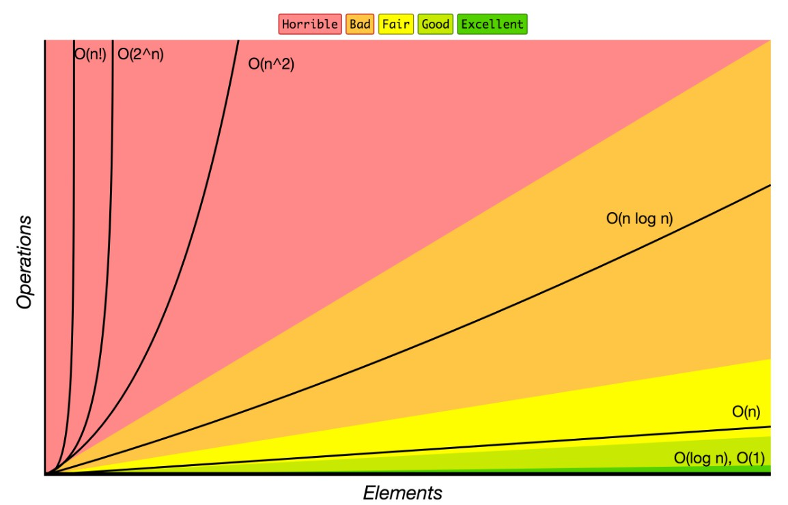
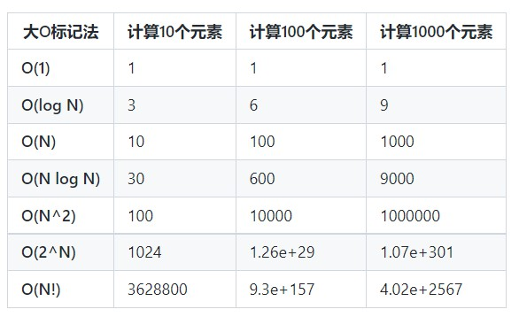
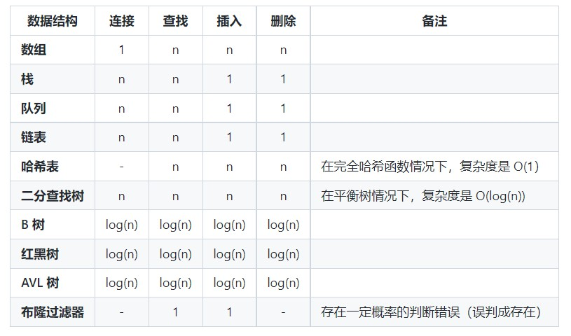
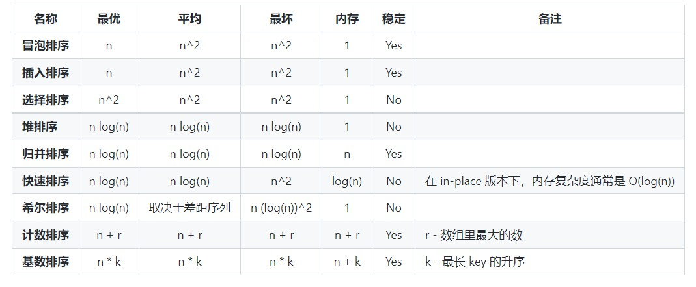

# algorithm_Learning

    
    
    

本仓库包含了多种基于 `Java` 的算法与数据结构。
为了记录算法学习过程中遇到的常见算法进行记录。主要是通过文档的形式，代码呢？也是通过`Java`来实现的。

注意：这个项目仅用于学习和研究.
本项目可能会涉及到具体平台的题目。

## 🌱数据结构

数据结构是在计算机中组织和存储数据的一种特殊方式，使得数据可以高效地被访问和修改。更确切地说，数据结构是数据值的集合，表示数据之间的关系，也包括了作用在数据上的函数或操作。

- 链表
- 双向链表
- 队列
- 栈
- 哈希表
- 堆
- 优先队列
- 🍋字典树
- 树
  - 二叉查找数
  - 线段数
  - 红黑树
  - 树状数组（二叉树）

- 图
- 并查集
- 布隆过滤器

## 🚀算法

算法是如何解决一类问题的明确规范。算法是一组精确定义操作序列的规则。
- **数学**
- **集合**
- **字符串**
- **排序**
- **搜索**
- **链表**
- **图**
- **没有分类**
  - 八皇后
  - 接雨水

## 🍋算法范式
- **贪心**
  - 跳跃游戏
  - 背包问题
- 动态规划(Dynamic programming)
- 回溯法    

算法范式是一种通用方法，基于一类算法的设计。这是比算法更高的抽象，就像算法是比计算机程序更高的抽象。

# 如何使用本仓库

下载`Java`的基础环境即可进行使用。

# 有用的信息

## 时间复杂度差距
下图展示了时间复杂度程度和好坏。

来源：<a href="https://www.bigocheatsheet.com/">Big O Cheat Sheet.</a>

以下是一些最常用的 大O标记法 列表以及它们与不同大小输入数据的性能比较。

## 数据结构操作的复杂性

## 各种排序的复杂度对比

